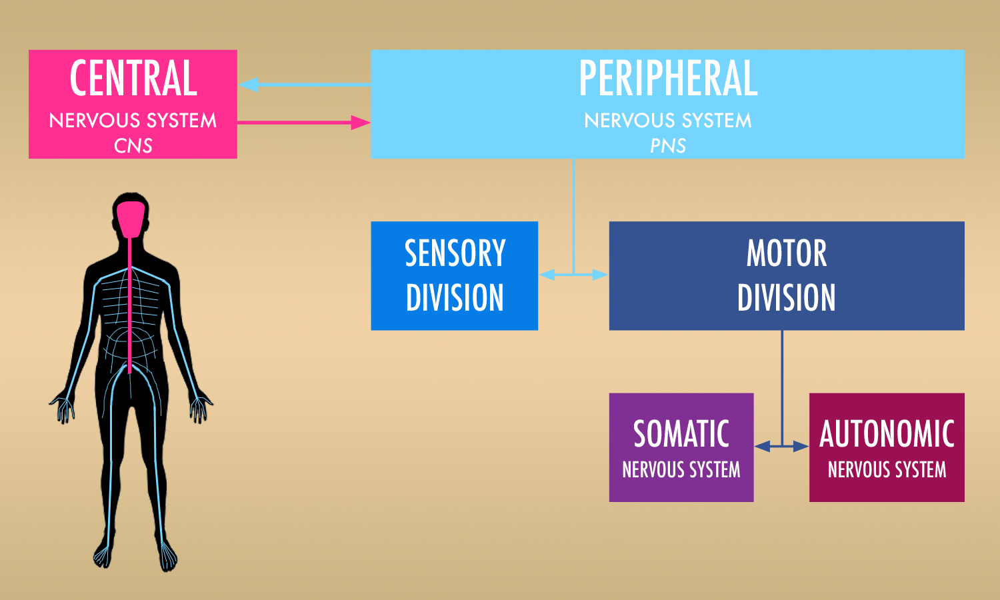
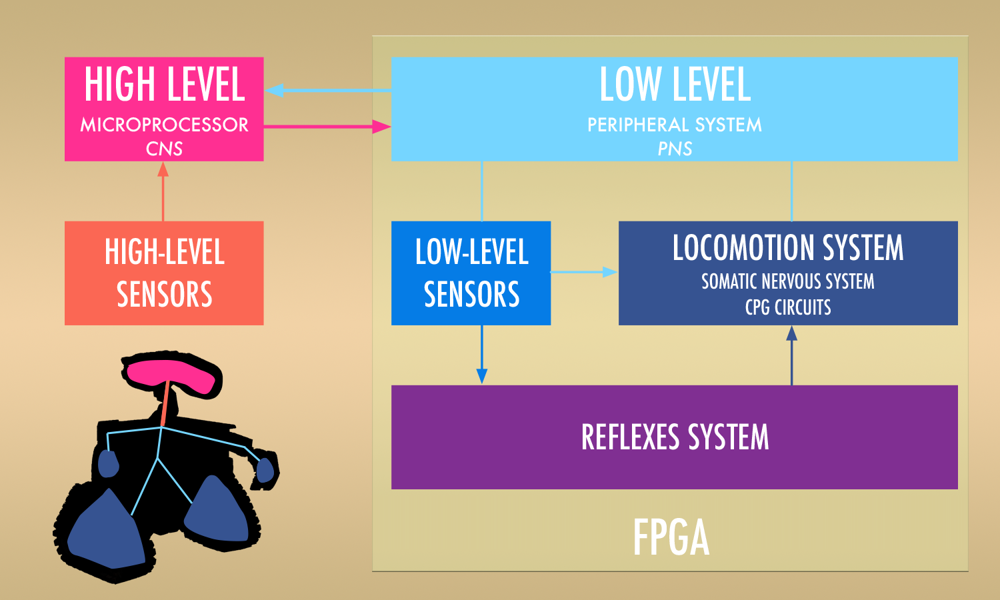

# FPGA- BIOROBOTS

## Hybrid bio-inspired architecture for robots using open source FPGAs.


Animal nervous system             |  Bio-inspired robot nervous system
:-------------------------:|:-------------------------:
  |  


:gb: A robotic control architecture inspired in the animal nervous system that combines the use of microcomputers as the brain with the use of Open Source FPGAs as the nervous system.

Here you can find all the publications, material, robots, tools, circuits and programs developed for my master thesis work at Universidad Politécnica de Madrid.


***

:es: Repositorio con el material generado para mi trabajo de fin de Master de Robótica y Automática por la Universidad Politécnica de Madrid sobre el desarrollo de una arquitectura de control robótica híbrida y bioinspirada combinando microprocesadores y FPGAs libres.


***
## Publications

### IROS 2018 Paper

Part of this project has been published at **_2018 IEEE/RSJ International Conference on Intelligent Robots and Systems_** or **_IROS 2018_** with the title:

_"Hybrid Bio-Inspired Architecture for Walking Robots Through Central Pattern Generators Using Open Source FPGAs"_

https://ieeexplore.ieee.org/abstract/document/8594288

You can cite this article on bibtex with:

```
@inproceedings{linares2018hybrid,
  title={Hybrid bio-inspired architecture for walking robots through Central Pattern Generators using open source FPGAs},
  author={Linares, Juli{\'a}n Caro and Barrientos, Antonio and M{\'a}rquez, Enric Mayas},
  booktitle={2018 IEEE/RSJ International Conference on Intelligent Robots and Systems (IROS)},
  pages={7071--7076},
  year={2018},
  organization={IEEE}
}
```

### Master Thesis Memory

You can read and download the memory document of this Master Thesis project under Creative Commons License here:

<a href="https://github.com/jcarolinares/fpga-biorobots/blob/final-revision-cleaning/Thesis%20Memory/MasterThesis-BioInspiredrobotsOpenSourceFPGAs.pdf" target="_blank"></a>


***

<a rel="license" href="http://creativecommons.org/licenses/by-sa/4.0/"></a><br /><span xmlns:dct="http://purl.org/dc/terms/" property="dct:title">FPGA-Biorobots</span> by <span xmlns:cc="http://creativecommons.org/ns#" property="cc:attributionName">Julián Caro Linares</span> licensed by <a rel="license" href="http://creativecommons.org/licenses/by-sa/4.0/">Creative Commons Attribution-ShareAlike 4.0 International License</a>.<br /><br />
