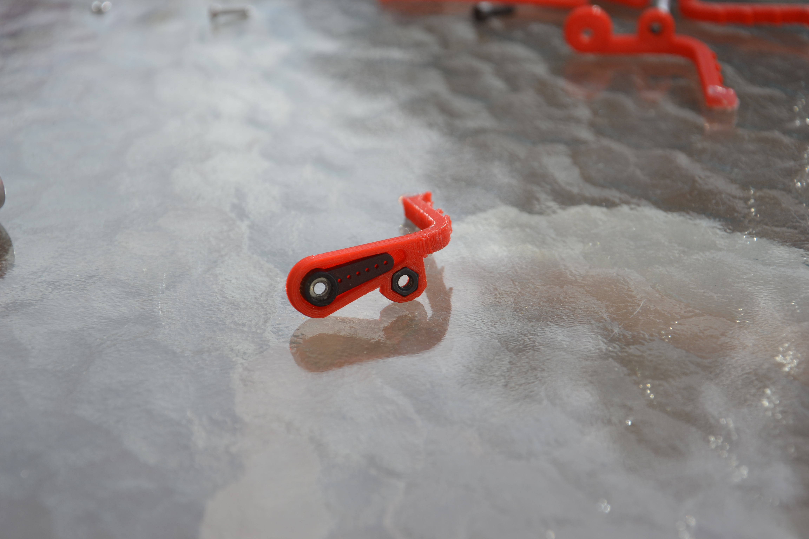
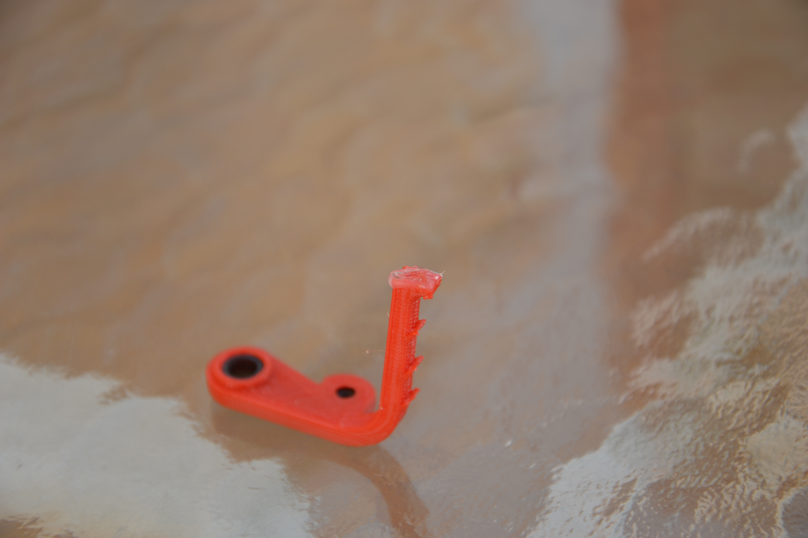
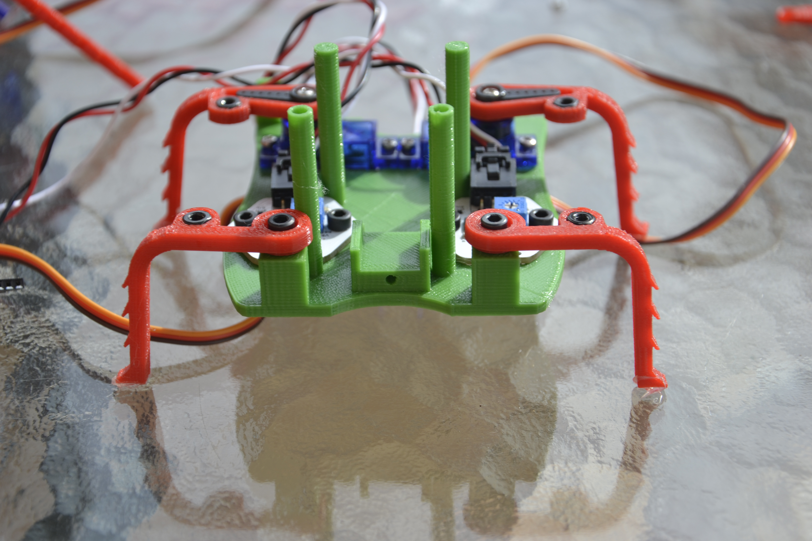

# Doodle- Assembly instructions

  

**Read this in other languages:** [Spanish](README.md)

**Some videos of Doodle**

   
  
  
  
  

Here you have a step by step guide to assemble the Doodle robot. Doodle is a very simple robot and its building shouldn't take more than 30 minutes.

## Materials

### Electronic

* 1x-Icezum Alhambra, Arduino UNO or an equivalent board.

* 3x-Micro small micro servomotors of the family SG90R. In the original robot I've used ** SG92R ** servomotors but any similar servomotor should work.

* [Optional] 2x-Lipo batteries: 3.7 V 240 mAh + Compatible charger. There are many options on the internet, an example:

  http://www.dx.com/p/502030-240mah-rechargeable-polymer-li-ion-battery-silver-227107

* [Optional] Additional sensors or servomotors. In the front part of the robot there's two general purpose holes where you can add sensors of a Educational robotis kits (Example: bq sensors) or two servomotors

### Screws and servomotors horns

You'll need **M3 and M2 screws and nuts**, also the small screws that come with the servomotors. The long of each screw is not important so you'll could build the robot using any M3 or M2 screw that you have.

* 4x-Screws M2x10

* 1x-Screw M2x15 or similar

* 8x-Screws M3x8

* 4x-Screws M3x25 [2 Optional-Battery holder]

* Screws and horns included with the servomotors.

* 1x-Double horn

* 2x-Single horn

### 3D parts

You'll need to print:

* 1x-Front left leg

* 1x-Front right leg

* 1x-Back left leg

* 1x-Back right leg

* 1x- Central leg

* 2x Leg links

* 1x base

* [Opcional] 1x- Battey holder

* [Opcional] 2x- Googly eyes

***
## Assembly step by step

**1-** Put the two servomotors in the back holes of the robot using M2x10 screws and nuts.

  

**2-** Carefully, insert the M3 nut inside each leg, depending of your 3D printer quality you'll need to push the nuts with a little pressure, even heating up the nuts a little bit

  

  **Tip:**

  It is not essential but you can put a bit of silicone at the end of the legs using a hot melt gun. Your robot will have a better adhesion to the surface.

  

**3-** Insert the single horns in each leg and attach them to the servomotors. Althought you can fix it later without problems, **is important** that at this moment you can try to put the legs on the servos in order to have an amplitude of 90 degrees backwards and forward. The position where the legs are perpenticular to the base has to be 90 degrees on your servo. You can create a simple program for this purpose. Screw the legs to the servomotors.

     

**4-** If you are going to put some sensors or additional servomotors in the front holes it's  the right time to do it. Use M3 Screws and nuts for the sensors and M2 for the servomotors.

  

  **Tip:**

  If you are going to use the battery holder, screw it only the sensors screws near the outside of the base, leave the central holes empty.

**5-** Screw the front legs in the front holes using M3 screws and nuts. Keep in mind that the leg has to turn free so don't tight it up too much. If you are going to use the battery holder, use longer screws like M3x18.

  

**6-** Screw the leg links on the legs. The bug hairs have to be at the outside . Use M3x8 and remember to let that the legs can move free.

  

**7-** Put the double horn in the central leg. Attach the leg to the servomotor keeping in mind that the 90º degrees position will be the neutral position of the leg.

  

**8.** Fit the central servomotor in the base using a long M2 screw and a nut.

  

**9-** Attach your FPGA Icezum Alhmabra or Arduino UNO board (or similar) on the columns using M3 screws.

  

  **Tip:**

  Before the board attachment

  Before placing the board, make sure that your cables pass through the central area of the robot at the rear, between the two servos.

  

**10-** Customize your robot putting a pair of googly eyes in the front.

Doodle is ready!

  

***
[Optional-Battery holder]

In the case you wish to use the battery holder you'll have to use long M3x18 screws in the step 5.

***

 Doodle  by Julián Caro Linares licensed by <a rel="license" href="http://creativecommons.org/licenses/by-sa/4.0/">Creative Commons Attribution-ShareAlike 4.0 International License</a>.  
